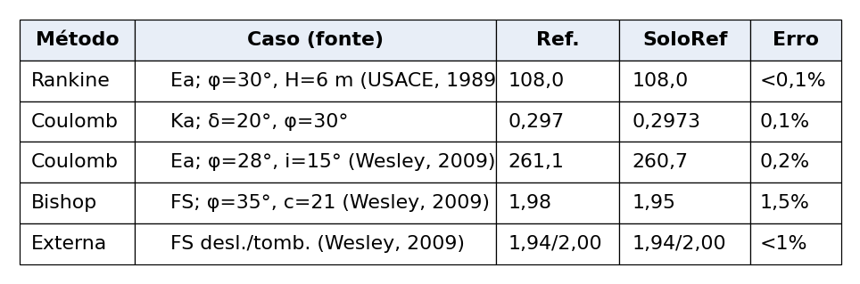
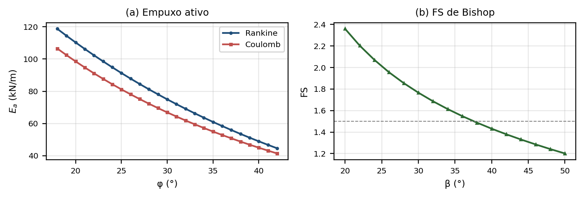

# Desenvolvimento e Validação de um Programa Computacional Aberto para Análise de Estabilidade e Dimensionamento de Estruturas de Solo Reforçado

**Yves Gabriel Queiroz de Sousa¹, José Antonio Schiavon²**

¹ Instituto Tecnológico de Aeronáutica (ITA), bolsista PIBIC — yves.sousa.8821@ga.ita.br · ² Instituto Tecnológico de Aeronáutica (ITA), orientador

## Resumo

A análise de estabilidade de taludes e o dimensionamento de contenções, usualmente apoiados em pacotes comerciais proprietários ou em programas legados que não executam em sistemas atuais, motivam este trabalho. Apresenta-se o desenvolvimento e a validação do SoloRef, programa aberto e multiplataforma que reimplementa, em Python, um programa legado escrito para Windows de 16/32 bits. O programa reúne os métodos de equilíbrio-limite de cunha plana (Coulomb, Rankine e dois blocos), a cunha circular de Bishop, o dimensionamento com geossintéticos e as verificações de estabilidade externa. A separação entre cálculo e interface permitiu validação automatizada: os casos de fórmula fechada apresentaram erro inferior a 0,2%; o método de Bishop reproduziu um exemplo de talude de Wesley (2009) com erro de 1,5% no fator de segurança; e a verificação externa reproduziu um muro reforçado com concordância de 1%. A contribuição deste trabalho é disponibilizar uma ferramenta aberta, didática e validada, com 125 testes automatizados que garantem a reprodutibilidade. Conclui-se que ela é adequada para uso didático e para análises preliminares de projeto.

**Palavras-chave:** estabilidade de taludes. solo reforçado. equilíbrio-limite. geossintéticos.

## 1. Introdução

A análise de estabilidade de taludes e o projeto de contenções são atividades críticas da engenharia geotécnica, pois rupturas podem causar prejuízos econômicos e riscos à vida. Os procedimentos consolidados baseiam-se no equilíbrio-limite, com destaque para os métodos de cunha plana — Coulomb, Rankine e a cunha bilinear de dois blocos — e para a superfície circular do método simplificado de Bishop (BISHOP, 1955; DAS, 2014). O reforço de solos com geossintéticos ampliou as soluções para muros e taludes íngremes, exigindo procedimentos específicos de dimensionamento (KOERNER, 2012). Computacionalmente, esses métodos são oferecidos por pacotes comerciais robustos, como o SLOPE/W e o Slide (ROCSCIENCE, 2023), amplamente usados na prática, porém proprietários e pouco transparentes quanto aos passos intermediários, o que limita seu uso didático.

Este trabalho baseou-se nas formulações de equilíbrio-limite de Das (2014) e Wesley (2009) — que fornece exemplos numéricos resolvidos úteis para verificação — e nas diretrizes de reforço de Koerner (2012). A contribuição deste trabalho é disponibilizar uma ferramenta aberta, multiplataforma e validada contra a literatura, que integra num mesmo ambiente os métodos de cunha plana e circular, o dimensionamento com geossintéticos e a verificação de estabilidade externa, com testes automatizados que asseguram a reprodutibilidade. O objetivo é oferecer uma ferramenta acessível e didática para a análise comparativa desses métodos e para análises preliminares de projeto.

## 2. Metodologia

Foram implementados seis procedimentos: os empuxos ativos de Coulomb, Rankine e dois blocos (cunha bilinear); o fator de segurança de Bishop simplificado (cunha circular, com iteração e busca da superfície crítica); o dimensionamento interno com geossintéticos (equilíbrio-limite com fatores de redução de resistência); e as verificações externas de deslizamento, tombamento e capacidade de carga por fatores de Vésic. Para o empuxo ativo de Rankine, o coeficiente é dado pela Equação 1:

$$K_a = \tan^2\left(45^\circ - \frac{\varphi}{2}\right) \qquad (1)$$

em que $K_a$ é o coeficiente de empuxo ativo e $\varphi$ o ângulo de atrito interno. O empuxo resulta de $E_a = \tfrac{1}{2}K_a\gamma H^2 + K_a q H - 2cH\sqrt{K_a}$, com $\gamma$ o peso específico, $H$ a altura, $q$ a sobrecarga e $c$ a coesão.

O programa foi desenvolvido em Python, com PySide6 (interface) e NumPy/SciPy (cálculo). Adotou-se separação estrita entre a camada de cálculo (Python puro) e a interface, o que permite validar os métodos por scripts. A interface reúne, em painel único, a entrada de dados, o desenho da estrutura com a superfície de ruptura calculada e um quadro comparativo entre métodos. A validação confrontou as saídas com valores publicados: casos de fórmula fechada, o caso-limite em que Coulomb (atrito nulo, parede vertical) se reduz a Rankine, e exemplos resolvidos de Bishop e de estabilidade externa (WESLEY, 2009; USACE, 1989).

## 3. Resultados e Discussão

A Tabela 1 resume a validação. Os casos de fórmula fechada apresentaram erro inferior a 0,2%, e a identidade entre Coulomb e Rankine foi reproduzida ao nível da precisão numérica da máquina. Nos métodos com busca da superfície crítica (Bishop e estabilidade externa), a concordância com Wesley (2009) ficou entre 1% e 1,5%, compatível com diferenças de discretização. O conjunto foi consolidado em 125 testes automatizados, evitando regressões nos resultados.

{width=8.2cm}

**Tab. 1** – Validação do SoloRef contra a literatura (Ea em kN/m; Ka e FS adimensionais).

A Figura 1 ilustra o uso em análises paramétricas. Em (a), o empuxo ativo de Rankine e Coulomb decresce com φ; o de Coulomb é menor porque o atrito solo-muro ($\delta = 2\varphi/3$) mobiliza uma parcela vertical que alivia a estrutura. Em (b), o fator de segurança de Bishop diminui com a inclinação do talude, cruzando o valor usual de projeto ($FS = 1{,}5$) próximo de $\beta = 38^\circ$ para a geometria analisada. Os resultados evidenciam a capacidade da ferramenta de apoiar estudos comparativos e de sensibilidade.

{width=8.2cm}

**Fig. 1** – Análises com o SoloRef: (a) empuxo ativo em função de φ; (b) fator de segurança de Bishop em função da inclinação do talude.

## 4. Conclusões

Desenvolveu-se e validou-se o SoloRef, programa aberto e multiplataforma que integra os métodos de cunha plana (Coulomb, Rankine e dois blocos), a cunha circular de Bishop, o dimensionamento com geossintéticos e a verificação de estabilidade externa. A concordância com a literatura — erro inferior a 0,2% nos casos de fórmula fechada e entre 1% e 1,5% nos métodos com busca de superfície crítica — indica que a implementação reproduz fielmente as formulações. A separação entre cálculo e interface, com 125 testes automatizados, confere reprodutibilidade e facilita a extensão da ferramenta.

Como trabalhos futuros, recomenda-se: (i) incorporar o nível d'água e a poropressão, frequentemente determinantes na estabilidade; (ii) implementar a verificação de estabilidade global (superfície profunda sob o maciço reforçado); (iii) gerar automaticamente o memorial de cálculo em PDF; e (iv) validar o programa contra casos instrumentados de campo e pacotes comerciais consagrados.

## 5. Agradecimentos

Os autores agradecem ao CNPq pelo apoio por meio de bolsa PIBIC e ao Instituto Tecnológico de Aeronáutica.

## Referências

BISHOP, A. W. The use of the slip circle in the stability analysis of slopes. *Géotechnique*, v. 5, n. 1, p. 7–17, 1955.

DAS, B. M. *Fundamentos de engenharia geotécnica*. 7. ed. São Paulo: Cengage Learning, 2014.

KOERNER, R. M. *Designing with geosynthetics*. 6. ed. [S.l.]: Xlibris, 2012.

ROCSCIENCE INC. *Slide2: 2D limit equilibrium slope stability analysis*. Toronto, 2023.

USACE. *EM 1110-2-2502: Retaining and flood walls*. Washington: U.S. Army Corps of Engineers, 1989.

WESLEY, L. D. *Fundamentals of soil mechanics for sedimentary and residual soils*. Hoboken: John Wiley & Sons, 2009.
